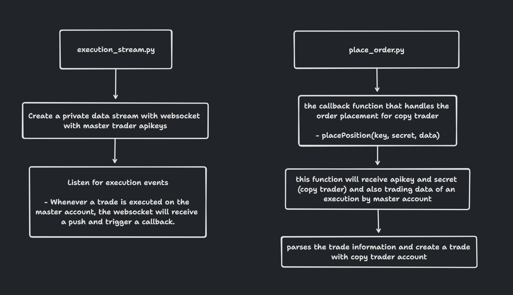

# Bybit Copytrade

## Table of contents

- [Installation](#installation)
- [Run scripts](#run-scripts)
- [Troubleshooting](#troubleshooting)
- [Strategy](#strategy)
- [Demo Video](#demo-video)

## Installation

```
pnpm install
```

## Run scripts

### Streaming data for spot trading on USDTBTC

```
python python/execution_stream.py
```

This will create a websocket data stream that will receive push notifications from trade executions on the master account.

EXAMPLE RESPONSE

```python
data {
  category: 'spot',
  symbol: 'BTCUSDT',
  closedSize: '',
  execFee: '0.000000318',
  execId: '2100000000049902216',
  execPrice: '34576.75',
  execQty: '0.000318',
  execType: 'Trade',
  execValue: '10.99540650',
  feeRate: '0.001',
  tradeIv: '',
  markIv: '',
  blockTradeId: '',
  markPrice: '',
  indexPrice: '',
  underlyingPrice: '',
  leavesQty: '0.000000',
  orderId: '1561932052297946624',
  orderLinkId: '1700932810291',
  orderPrice: '0',
  orderQty: '0.000000',
  orderType: 'Market',
  stopOrderType: '',
  side: 'Buy',
  execTime: '1700932810282',
  isLeverage: '0',
  isMaker: False,
  seq: 1262245182
}
```

Upon hitting a trade execution on master trader's account the copy trader account will copy the trade details and then make a similar trade.

EXAMPLE RESPONSE OF SUCCESSFUL ORDER ON COPY TRADER ACCOUNT

```python
response {
  retCode: 0,
  retMsg: 'OK',
  result: {
    orderId: '1561932064008443136',
    orderLinkId: '1561932064008443137'
  },
  retExtInfo: {},
  time: 1700932811678
}

```

## Troubleshooting

### ETIMEDOUT error from bybit api calls

Choices of vpn for this project is Windscribe. Do download windscribe and connect to non-US server IPs if you encounter errors like ETIMEDOUT.

## Strategy



## Demo Video

[Demo Video - Google Drive Link](https://drive.google.com/file/d/1jpTJXPiZDWJJWxewMOCY5KexwSYtA1Tl/view?usp=sharing)
